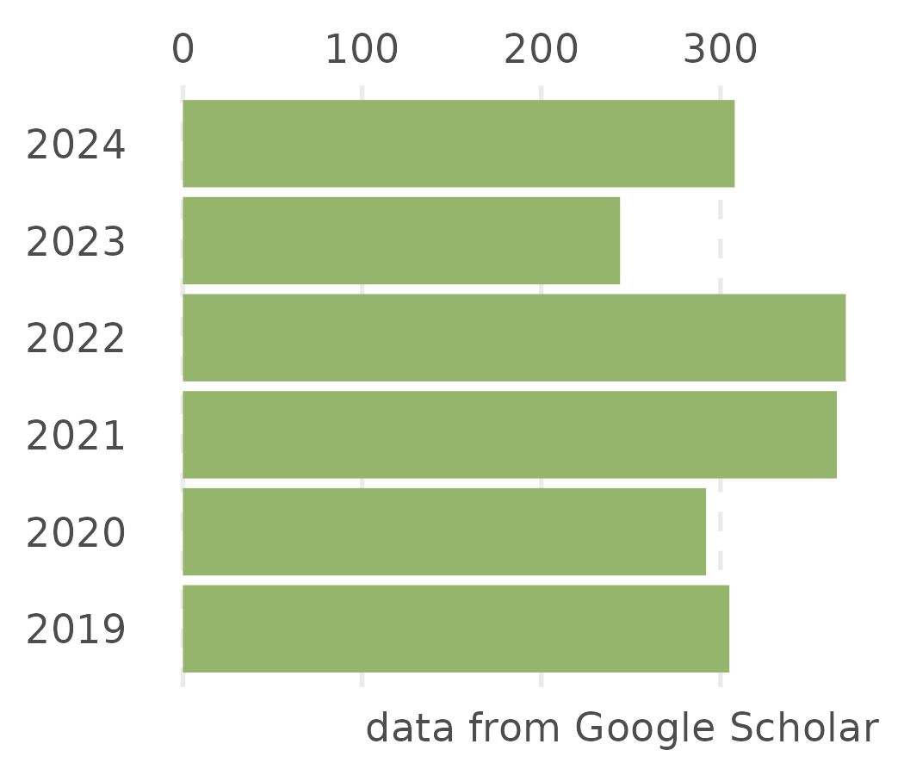

```{r, include=FALSE}
knitr::opts_chunk$set(
  results='asis', 
  echo = FALSE
)


CRANpkg <- function (pkg) {
    cran <- "https://CRAN.R-project.org/package"
    fmt <- "[%s](%s=%s)"
    sprintf(fmt, pkg, cran, pkg)
}

Biocpkg <- function (pkg) {
    sprintf("[%s](http://bioconductor.org/packages/%s)", pkg, pkg)
}

library(glue)
library(tidyverse)
library(readxl)

# Set this to true to have links turned into footnotes at the end of the document
PDF_EXPORT <- FALSE

# Holds all the links that were inserted for placement at the end
links <- c()

find_link <- regex("
  \\[   # Grab opening square bracket
  .+?   # Find smallest internal text as possible
  \\]   # Closing square bracket
  \\(   # Opening parenthesis
  .+?   # Link text, again as small as possible
  \\)   # Closing parenthesis
  ",
  comments = TRUE)

sanitize_links <- function(text){
  if(PDF_EXPORT){
    str_extract_all(text, find_link) %>% 
      pluck(1) %>% 
      walk(function(link_from_text){
        title <- link_from_text %>% str_extract('\\[.+\\]') %>% str_remove_all('\\[|\\]') 
        link <- link_from_text %>% str_extract('\\(.+\\)') %>% str_remove_all('\\(|\\)')
        
        # add link to links array
        links <<- c(links, link)
        
        # Build replacement text
        new_text <- glue('{title}<sup>{length(links)}</sup>')
        
        # Replace text
        text <<- text %>% str_replace(fixed(link_from_text), new_text)
      })
  }
  
  text
}


# Takes a single row of dataframe corresponding to a position
# turns it into markdown, and prints the result to console.
build_position_from_df <- function(pos_df){
  
  missing_start <- pos_df$start == 'N/A'
  dates_same <- pos_df$end == pos_df$start
  if (pos_df$end == 9999) {
    pos_df$end = "至今"
  }
  if(any(c(missing_start,dates_same))){
    timeline <- pos_df$end
  } else {
    timeline <- glue('{pos_df$end} - {pos_df$start}')
  }

  descriptions <- pos_df[str_detect(names(pos_df), 'description')] %>% 
    as.list() %>% 
    map_chr(sanitize_links)
  
  # Make sure we only keep filled in descriptions
  description_bullets <- paste('-', descriptions[descriptions != 'N/A'], collapse = '\n')
  
  if (length(description_bullets) == 1 && description_bullets == "- ") {
    description_bullets <- ""
  }
  glue(
"### {sanitize_links(pos_df$title)}

{pos_df$loc}

{pos_df$institution}

{timeline}

{description_bullets}


"
  ) %>% print()
}

# Takes nested position data and a given section id 
# and prints all the positions in that section to console
print_section <- function(position_data, section_id){
  x <- position_data %>% 
    filter(section == section_id) %>% 
    pull(data) 
  
  prese <- " - "
  xx <- list()

  for (i in seq_along(x)) {    
      y = x[[i]]
      y <- cbind(y, start2 = as.character(y$start))
      y <- cbind(y, end2 = as.character(y$end))

      se <- paste(y$start, "-", y$end, collapse = " ")
      if (prese == se) {
        y$start2 = ""
        y$end2 = ""
      } else {
        prese = se
      }

    xx[[i]] <- select(y, -c(start, end)) %>%
      rename(start=start2, end=end2)
  }
    
  xx %>% 
    purrr::walk(build_position_from_df)
}


print_skill_bars <- function(skills, out_of = 5, bar_color = "#969696", bar_background = "#d9d9d9", glue_template = "default"){

  if(glue_template == "default"){
    glue_template <- "
<div
  class = 'skill-bar'
  style = \"background:linear-gradient(to right,
                                      {bar_color} {width_percent}%,
                                      {bar_background} {width_percent}% 100%)\"
>{skill}</div>"
  }
  skills %>%
    dplyr::mutate(width_percent = round(100*as.numeric(level)/out_of)) %>%
    glue::glue_data(glue_template) %>%
    print()

}


fill_nas <- function(column){
  ifelse(is.na(column), 'N/A', column)
}

# Load csv with position info
position_data <- read_xlsx('cv.xlsx', sheet='positionsC', na = "NA") %>% 
  mutate_all(fill_nas) %>% 
  arrange(order, desc(end)) %>% 
  mutate(id = 1:n()) %>% 
  nest(data = c(-id, -section))
  
skills <- read_xlsx('cv.xlsx', sheet='language_skills')
```

```{r}
# When in export mode the little dots are unaligned, so fix that. 
if(PDF_EXPORT){
  cat("
  <style>
  :root{
    --decorator-outer-offset-left: -6.5px;
  }
  </style>")
}
```


Aside
================================================================================


{width=100%}

```{r}
# When in export mode the little dots are unaligned, so fix that. 
if(PDF_EXPORT){
  cat("View this CV online with links at _orionzhou.github.io/cv_")
}
```

联系方式 {#contact}
--------------------------------------------------------------------------------


- <i class="fa fa-github"></i> [github.com/orionzhou](https://github.com/orionzhou)
- <i class="fa fa-link"></i> [orionzhou.github.io](https://orionzhou.github.io)
- <i class="fa fa-envelope"></i> zhoupenggeni@gmail.com


Disclaimer {#disclaimer}
--------------------------------------------------------------------------------


最近更新于 `r Sys.Date()`.


Main
================================================================================

周鹏 {#title}
--------------------------------------------------------------------------------


```{r, results='asis'}
intro_text <- glue("<font size=2.5>来自明尼苏达大学双城分校的博士后研究员，主要研究兴趣为基因表达调控。结合传统遗传学、比较基因组学和多组学数据挖掘等手段研究植物在生长发育过程和胁迫条件下的基因表达调控机制，鉴定关键的顺式调控元件和反式作用因子用于作物改良。此外，我的研究兴趣还包括构建植物表达调控网络，训练机器学习模型用于预测基因的时空特异性表达模式，杂种优势的分子基础等。</font>")

cat(sanitize_links(intro_text))
```


教育背景 {data-icon=graduation-cap data-concise=true}
--------------------------------------------------------------------------------

```{r, results='asis', echo = FALSE}
print_section(position_data, 'education')
```

研究经历 {data-icon=laptop}
--------------------------------------------------------------------------------

```{r, results='asis', echo = FALSE}
print_section(position_data, 'research_positions')
```


代表性著作 {data-icon=book}
--------------------------------------------------------------------------------

```{r}
print_section(position_data, 'academic_articles0')
```

其他著作 {data-icon=book}
--------------------------------------------------------------------------------

::: aside

```{r}
profile = jsonlite::fromJSON("profile.json")

  glue(

"
+ Citation = {profile$total_cites}
+ H-index = {profile$h_index}
+ I10-index = {profile$i10_index}

"
  ) %>% print()

```


:::

```{r}
print_section(position_data, 'academic_articles')
```


职业经历 {data-icon=user-friends}
--------------------------------------------------------------------------------

### 杂志审稿人

N/A

N/A

- Plant Biotechnology Journal
- Plant Science
- The Plant Genome
- Plant Direct
- Crop Science


大会经历 {data-icon=group}
--------------------------------------------------------------------------------


```{r}
print_section(position_data, 'conference')
```


应邀报告 {data-icon=group}
--------------------------------------------------------------------------------


```{r}
print_section(position_data, 'presentation')
```


```{r}
if(PDF_EXPORT){
  cat("
  
Links {data-icon=link}
--------------------------------------------------------------------------------


")
  
  walk2(links, 1:length(links), function(link, index){
    print(glue('{index}. {link}'))
  })
}
```


